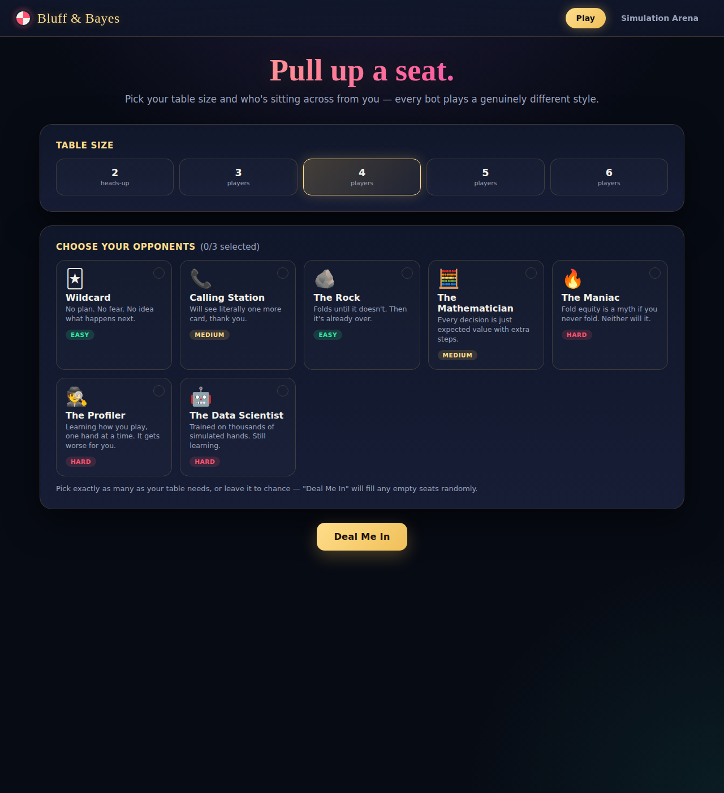
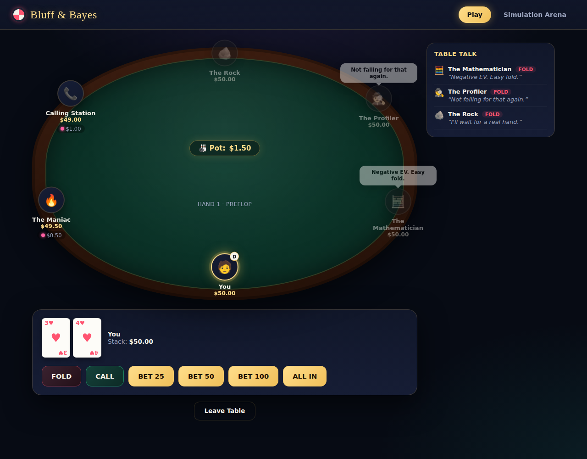

# Bluff & Bayes

[](https://github.com/Aniketh-droid/Bayesian_poker_agent/actions/workflows/tests.yml)
[](LICENSE)
[](https://www.python.org/downloads/)

A playable No-Limit Texas Hold'em web app: sit down at a configurable 2-6 player table against a roster of AI opponents that each play a genuinely different, model-backed style — from a Monte-Carlo EV grinder to a Bayesian opponent-profiler that gets better at reading you the longer you play. Every bot talks trash. Nobody folds the same way twice.

| Pick your table | Live at the felt |
| --- | --- |
|  |  |

## 🎲 Overview

Under the hood this is a from-scratch N-handed (2-6 player) poker engine — full side-pot math, button-relative blinds, multiway all-in run-outs — driving a roster of agents that range from simple rule-based personalities to a Bayesian belief-tracker that maintains an independent opponent model *per seat* at the table. None of the bots are neural-network black boxes: every decision traces back to an inspectable expected-value calculation.

### The Bot Roster

| Bot | Personality | Model | Difficulty |
|---|---|---|---|
| 🃏 Wildcard | No plan, no fear | Random actions (baseline) | Easy |
| 🪨 The Rock | Folds until it doesn't | Static tight rules | Easy |
| 📞 Calling Station | Sees one more card, always | Static loose-passive rules | Medium |
| 🧮 The Mathematician | Pure pot odds, no reads | Monte Carlo EV (multiway-aware) | Medium |
| 🔥 The Maniac | Bets and raises constantly | Static loose-aggressive rules | Hard |
| 🕵️ The Profiler | Learns your tendencies hand by hand | Per-opponent Bayesian belief + empirical-Bayes adaptation | Hard |
| 🤖 The Data Scientist | Trained on simulated hands | Ensemble of the EV + Bayesian models (see below) | Hard |

Every bot is wired through `agents/personalities.py`, a metadata/taunt registry decoupled from actual decision logic — it's purely presentational (avatar, tagline, situational trash talk), so the personality layer and the decision layer can evolve independently.

### About "The Data Scientist"

The original plan for this slot was a DataRobot AutoML model trained on self-play data. **That integration is currently on hold**: this environment's network egress policy blocks `app.datarobot.com` (confirmed via a direct connection test, not assumed), so the training/deployment step can't run here. Rather than ship a disabled personality, `agents/data_scientist_agent.py` is a genuine interim bot — an ensemble that averages the EV agent's and Bayesian agent's per-action value estimates — so the seat is fully playable today. The class is structured with a clean swap-in point for a real DataRobot deployment once network access is available; see the docstring in that file.

### Key Features
*   **True multiway engine**: side pots, button-relative blinds, and all-in run-outs generalized from a 2-player-only engine, verified with dedicated stress tests (`tests/test_multiway_engine.py`) hammering unequal all-in stacks for zero-sum and no-negative-stack invariants across 2-6 handed tables.
*   **Per-opponent Bayesian modeling**: `BayesianAgent` ("The Profiler") tracks an independent belief distribution and empirical fold/call statistics *for every live opponent*, not one shared model — so it reads a Maniac differently from a Rock, updating each in real time.
*   **A live taunt feed**: every action and every hand result can trigger a personality-appropriate line, shown as a floating speech bubble over the bot's seat and logged in the "Table Talk" panel.
*   **Configurable tables**: 2 to 6 players, pick your opponents from the roster or hit "Deal Me In" to fill empty seats randomly.
*   **Interactive Web App**: a Flask backend with isolated per-session game state, so multiple people can each play their own match concurrently.
*   **Simulation Arena**: the original academic head-to-head benchmark (Bayesian vs EV vs Random) is still here as a secondary mode — see below.

---

## 🧠 Core Architecture & Mathematical Flow

1.  **Game Engine (`engine/`)**: `GameState` and `play_hand_multiway()` handle the full rules of N-handed Texas Hold'em — pot/side-pot tracking, board cards, legal actions, all-in run-outs.
2.  **Belief Module (`belief/`)**: When an opponent acts, Bayesian-backed agents use Bayes' Theorem and likelihood tables to update a probability distribution over that opponent's hand "bucket" — tracked per-seat at a multiway table.
3.  **Decision Engine (`decision/`, `evaluation/`)**: Runs Monte Carlo simulations (multiway-aware via `estimate_equity_multiway`) against the current belief(s) to estimate win equity, and computes the Expected Value of folding, calling, or betting (`compute_ev` / `compute_ev_multiway`).
4.  **Web UI (`app.py`, `static/`)**: Runs a persistent multi-hand match per browser session — stacks carry over, the button rotates, and the game continues until you bust, the table busts, or you leave.

---

## 🚀 Getting Started

### Prerequisites
*   Python 3.8+

### Installation
1. Clone the repository:
   ```bash
   git clone https://github.com/Aniketh-droid/Bayesian_poker_agent.git
   cd Bayesian_poker_agent
   ```
2. Install dependencies:
   ```bash
   pip install -r requirements.txt
   ```
   For running the test suite too, install the dev requirements instead:
   ```bash
   pip install -r requirements-dev.txt
   ```

### Usage

**1. Play the game (Web UI)**
Run the Flask server:
```bash
python app.py
```
*Navigate to `http://localhost:5000` in your browser.* Pick a table size (2-6), choose your opponents from the roster (or let "Deal Me In" fill the rest randomly), and play. Set `FLASK_SECRET_KEY` in your environment for a stable session key across restarts (otherwise a random one is generated each time the server starts).

**2. Play heads-up against the AI (Terminal)**
Prefer the command line? `play_human.py` runs the original 2-player engine in a plain-text REPL:
```bash
python play_human.py
```

**3. Run headless benchmarks**
To run massive AI vs AI multi-seed experiments and print statistical summaries (Mean Chip Gain, Confidence Intervals) for the original 2-player research agents:
```bash
python main.py
```
Every parameter is configurable via CLI flags:
```bash
python main.py --hands 5000 --samples 100 --seeds 1 2 3 --matchups bayesian_vs_ev bayesian_vs_random
```
Run `python main.py --help` for the full list. The web UI's "Simulation Arena" tab runs a faster, fixed-seed version of the same thing in the browser.

### Running Tests
```bash
pip install -r requirements-dev.txt
pytest
```
The suite covers the hand evaluator, hand bucketing, the Bayesian belief update, the opponent model, EV calculation (heads-up and multiway), Monte Carlo equity estimation (including multiway), the action space/legality rules, seed reproducibility, street threading through `observe()`, the empirical-Bayes opponent-stats shrinkage, the N-handed engine (side pots, zero-sum invariants, fold-down-to-one, heads-up backward compatibility), and an end-to-end integration test that plays full hands through the real engine. CI runs this suite on every push via GitHub Actions (see the badge above).

### Running with Docker
```bash
docker build -t bayesian-poker-agent .
docker run -p 5000:5000 -e FLASK_SECRET_KEY=$(openssl rand -hex 32) bayesian-poker-agent
```
This is the easiest way to deploy the web UI to a host like Render, Fly.io, or Railway for a live, shareable demo link.

---

## 📊 Simulation Arena: The Research Mode

Before this was a playable game, it started as a 2-player research project comparing decision models head-to-head. That comparison is still available — in the web UI's **Simulation Arena** tab, or via `main.py` on the command line — and the underlying result is genuinely interesting enough to keep documented here.

*   **Random Agent**: Selects purely random actions. Used as an absolute baseline.
*   **EV Agent**: Plays "ABC" poker. It calculates EV but assumes the opponent's hole cards are completely random. Mathematically sound, but heavily exploitable.
*   **Bayesian Agent**: Dynamically updates its belief about the opponent's hand and runs EV calculations against a narrowed range instead of a uniform one, and adapts its fold/call assumptions to each opponent's actually-observed behavior as a match progresses. It convincingly outperforms the Random baseline, and **beats the EV agent in expected value too** — though its raw win rate against EV stays under 50%, a real, explained property of its strategy (see below).

**Real Simulation Output (`main.py --hands 1500 --samples 50`, 5 seeds):**

| Matchup | Mean chip gain | Win rate | 95% CI |
|---|---|---|---|
| Bayesian vs EV | **+0.3297** | 44.43% | [0.0551, 0.6042] |
| Bayesian vs Random | +4.9238 | 46.85% | [4.3615, 5.4861] |
| EV vs Random | +5.6547 | 62.47% | [4.8516, 6.4577] |

So the actual ranking by expected value is **Bayesian > EV > Random**: the Bayesian agent's mean chip gain against the EV agent is positive with a 95% CI entirely above zero, and all 5 individual seeds were positive too — a consistent, reproducible result. Its win rate against EV (44.43%) is still below 50%: it wins fewer hands than it loses, but wins bigger ones, coming out ahead on chips overall — a legitimate value-betting/bluff-catching tradeoff once its opponent model is calibrated correctly.

<details>
<summary><b>⚠️ Known Limitations &amp; how the Bayesian-vs-EV gap was diagnosed and fixed (click to expand)</b></summary>

The Bayesian agent losing to the simpler EV agent was diagnosed down to two compounding root causes in the code. Both are now fixed and verified at full benchmark scale (see the table above):

1.  **A real bug, now fixed: `observe()` wasn't receiving the actual street.** `engine/game_engine.py` used to call `agents[1 - pid].observe(action)` with no `street` argument, and `BayesianAgent.observe(self, opponent_action, street=0)` silently defaulted to street `0` (preflop) for every call — so every postflop belief update was computed against the *preflop* row of the likelihood tables in `opponent_model.py`, regardless of what street the action actually happened on. **Fixed**: the engine now captures the street *before* `apply_action()` (since a check/call closing the street can advance it as a side effect) and passes it through, with a regression test (`tests/test_observe_street_threading.py`) asserting the engine reports real, non-decreasing streets across a hand instead of always `0`. On its own this narrowed the gap without closing it, because item 2 below was still uncorrected.
2.  **A design limitation, now mitigated: the opponent archetype was a static, unlearned label.** `main.py` hard-codes `opponent_type="TIGHT"` when the Bayesian agent faces the EV agent, but `EVAgent` doesn't play like any hard-coded archetype — it best-responds to real Monte Carlo equity with no concept of hand buckets. Measuring `EVAgent`'s *actual* fold frequency by hand bucket against the table the Bayesian agent assumed showed large, systematic gaps. Sweeping the opponent archetype (`TIGHT` / `LOOSE` / `AGGRESSIVE`) confirmed this wasn't a "wrong preset" problem: none of the three static labels let the Bayesian agent beat the EV agent.

    **Fix**: `belief/opponent_stats.py` adds an `OpponentStats` tracker that records the opponent's real fold vs. call/check responses per street across an entire match. `decision/ev_calculator.compute_ev()`'s bet-EV branch now blends the static archetype-table prior with these empirical per-street rates via empirical-Bayes shrinkage (`blend_with_prior()`, prior worth 10 pseudo-observations): with zero real observations it's numerically identical to the old static-only behavior, and as a match accumulates hands, the estimate converges toward the opponent's true frequency.

    This is a real behavioral tradeoff, not a free lunch: `RandomAgent` has no stable fold/call tendency for the tracker to learn, so the same correction adds variance rather than signal there — Bayesian vs Random's mean chip gain is statistically unchanged but its win rate dropped from ~55% to ~47%, the same expected value delivered through fewer, larger wins.

With both root causes addressed, the Bayesian agent now beats the EV agent in expectation as well as beating Random. The remaining honest caveat is scope: this fix corrects one scalar pair (fold/call rate) per street via shrinkage — it doesn't touch bet-sizing frequency, the hand-bucket likelihood tables themselves, or give the agent a genuinely *learned* representation of its opponent.

**Multiway simplification, disclosed rather than hidden**: at a 3-6 handed table, `compute_ev_multiway()` computes "does everyone fold" as the *product* of each live opponent's individual fold probability — a deliberate simplification, not a full N-player game-theoretic solve (a real multiway solve needs CFR-style search over every opponent's response). It captures the right qualitative shape (more live opponents → harder to bluff everyone off a hand) without needing a full solver in a real-time bot's hot path — the right tradeoff for a fun-first game, not a research claim of multiway optimality.

</details>

## 🔮 Future Improvements

*   **Real DataRobot deployment for The Data Scientist**: replace the current EV+Bayesian ensemble with an actual AutoML model trained on self-play data, once network access to DataRobot's API is available in this environment (see above).
*   **Dynamic RL Opponent Modeling**: go further than the existing empirical-Bayes fold/call correction — replace the hardcoded bet-sizing and hand-bucket likelihood tables with an online RL agent that learns an opponent's full playstyle over time.
*   **Deep RL for Multi-Street Planning**: `ev_calculator.py` currently uses a greedy, one-step EV algorithm; PPO-style training could let an agent learn multi-street bluff lines.
*   **Real human-vs-human tables**: the current build is human-vs-bots; networked human-vs-human seats at the same table is a natural next phase.
*   **Unsupervised hand bucketing**: cluster hole cards by mathematical equity (e.g. K-Means) instead of relying on static heuristic bucket definitions.

---

## 🤝 Contributing
Contributions, issues, and feature requests are welcome! Feel free to check the issues page.

## 📝 License
This project is licensed under the MIT License - see the [LICENSE](LICENSE) file for details.
