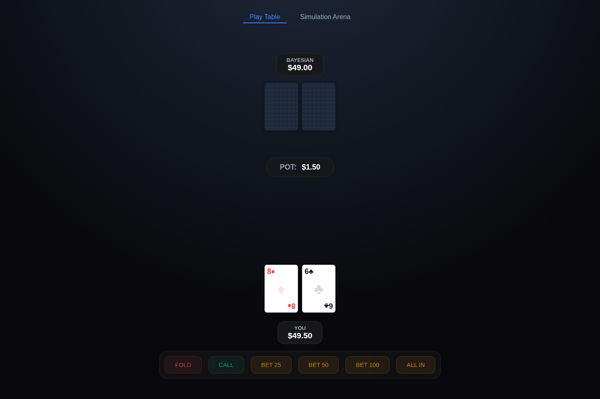
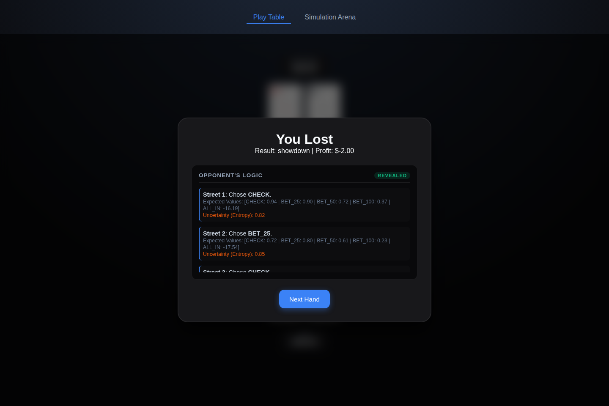

# Bayesian Poker Agent

[](https://github.com/Aniketh-droid/Bayesian_poker_agent/actions/workflows/tests.yml)
[](LICENSE)
[](https://www.python.org/downloads/)

A high-performance, Bayesian-inference-based poker agent for heads-up No-Limit Texas Hold'em. This project features a robust Python engine, a probabilistic decision-making AI, and a premium "glass-box" web interface that allows users to play against the AI while observing its real-time mathematical thought process.

| Live table | Glass-box reasoning, revealed at showdown |
| --- | --- |
|  |  |

## 🎲 Overview
Unlike traditional poker AIs that rely on computationally expensive Counterfactual Regret Minimization (CFR) and massive game trees, this agent uses **Bayesian Inference combined with Hand Bucketing**. 

This reduces the millions of possible poker states into a lightweight, easily computable probability problem that runs instantly. The agent calculates the **Expected Value (EV)** of every possible action dynamically, adjusting its strategy based on its calculated belief about the opponent's hidden cards.

### Key Features
*   **Bayesian "Glass Box" AI**: No neural network black-boxes here. The AI explicitly calculates probabilities across human-readable hand buckets (e.g., "Premium", "Air", "Strong Draw"), and the web UI reveals its full EV breakdown and belief entropy for every decision after each hand.
*   **Interactive Web App**: A Flask-based web interface for playing against the agents or visualizing massive AI vs. AI simulations directly in the browser. Each visitor gets isolated, per-session game state, so multiple people can play concurrently.
*   **Entropy-Gated Exploration**: The agent uses Shannon Entropy to measure its own uncertainty. It bluffs and explores when uncertain (high entropy), and plays pure EV poker when confident (low entropy).
*   **Highly Extensible**: Modular design makes it simple to plug in new opponent profiles, reinforcement learning algorithms, or hand evaluation techniques.

---

## 🧠 Core Architecture & Mathematical Flow

The project operates through a complete sense-think-act pipeline:

1.  **Game Engine (`engine/`)**: Handles the rigorous rules of Texas Hold'em, tracking pot sizes, board cards, and legal actions.
2.  **Belief Module (`belief/`)**: When the opponent acts, the AI uses Bayes' Theorem and hardcoded likelihood tables to update its probability distribution over what hand "bucket" the opponent holds.
3.  **Decision Engine (`decision/`, `evaluation/`)**: Runs thousands of Monte Carlo simulations against the current belief distribution to estimate win equity. It mathematically calculates the absolute Expected Value (EV) for folding, calling, or betting.
4.  **Web UI (`app.py`, `static/`)**: Visually renders the AI's internal thought process to the user, acting as a powerful educational tool for poker math.

---

## 🚀 Getting Started

### Prerequisites
*   Python 3.8+

### Installation
1. Clone the repository:
   ```bash
   git clone https://github.com/Aniketh-droid/Bayesian_poker_agent.git
   cd Bayesian_poker_agent
   ```
2. Install dependencies:
   ```bash
   pip install -r requirements.txt
   ```
   For running the test suite too, install the dev requirements instead:
   ```bash
   pip install -r requirements-dev.txt
   ```

### Usage

**1. Play Against the AI (Web UI)**
Run the Flask server to open the interactive frontend:
```bash
python app.py
```
*Navigate to `http://localhost:5000` in your browser.* Set `FLASK_SECRET_KEY` in your environment for a stable session key across restarts (otherwise a random one is generated each time the server starts).

**2. Play Against the AI (Terminal)**
Prefer the command line? `play_human.py` runs the same agents in a plain-text REPL:
```bash
python play_human.py
```

**3. Run Headless Simulations**
To run massive AI vs AI multi-seed experiments and print statistical summaries (Mean Chip Gain, Confidence Intervals):
```bash
python main.py
```
Every parameter is configurable via CLI flags instead of editing the script:
```bash
python main.py --hands 5000 --samples 100 --seeds 1 2 3 --matchups bayesian_vs_ev bayesian_vs_random
```
Run `python main.py --help` for the full list.

### Running Tests
```bash
pip install -r requirements-dev.txt
pytest
```
The suite covers the hand evaluator, hand bucketing, the Bayesian belief update, the opponent model, EV calculation (including a regression test for the sunk-cost fix described in `decision/ev_calculator.py`), Monte Carlo equity estimation, the action space/legality rules, seed reproducibility, and an end-to-end integration test that plays full hands through the real engine with the Bayesian agent. CI runs this suite on every push via GitHub Actions (see the badge above).

### Running with Docker
```bash
docker build -t bayesian-poker-agent .
docker run -p 5000:5000 -e FLASK_SECRET_KEY=$(openssl rand -hex 32) bayesian-poker-agent
```
This is the easiest way to deploy the web UI to a host like Render, Fly.io, or Railway for a live, shareable demo link.

---

## 📊 Statistics & Agent Types

The system ships with several agents to evaluate performance against:
*   **Random Agent**: Selects purely random actions. Used as an absolute baseline.
*   **EV Agent**: Plays "ABC" poker. It calculates EV but assumes the opponent's hole cards are completely random. Mathematically sound, but heavily exploitable.
*   **Bayesian Agent**: Dynamically updates its belief about the opponent's hand and runs EV calculations against a narrowed range instead of a uniform one. It convincingly outperforms the Random baseline, but **does not currently beat the EV agent head-to-head** - see Known Limitations below for why, with the measured root cause.

**Real Simulation Output (`main.py --hands 1500 --samples 50`, 5 seeds, current code):**

| Matchup | Mean chip gain | Win rate | 95% CI |
|---|---|---|---|
| Bayesian vs EV | **-0.8410** | 46.01% | [-0.9287, -0.7534] |
| Bayesian vs Random | +5.2501 | 55.35% | [4.8652, 5.6351] |
| EV vs Random | +5.7302 | 62.33% | [5.1807, 6.2797] |

So the actual ranking is **EV > Bayesian > Random**. The Bayesian agent's belief-tracking machinery clearly helps against Random (it beats it more convincingly than a naive baseline would), but it currently *loses* to the simpler EV agent by a statistically significant margin (the 95% CI for that matchup sits entirely below zero, and the effect is consistent across all 5 seeds individually). This is a genuine, reproducible result of the current implementation, not a stale or cherry-picked number - see below for the root cause.

---

## ⚠️ Known Limitations

The Bayesian agent losing to the simpler EV agent (above) was diagnosed down to two compounding, verified root causes in the current code:

1.  **A real bug: `observe()` never receives the actual street.** `engine/game_engine.py` calls `agents[1 - pid].observe(action)` with no `street` argument, and `BayesianAgent.observe(self, opponent_action, street=0)` silently defaults to street `0` (preflop) for every call - so every postflop belief update is computed against the *preflop* row of the likelihood tables in `opponent_model.py`, regardless of what street the action actually happened on. Patching the engine to pass the real street through (`agents[1 - pid].observe(action, street=acted_street)`, captured *before* `apply_action()` since a check/call can itself advance the street) measurably narrows the gap in isolated testing (Bayesian vs EV mean chip gain improved from about -0.73 to about -0.52 at a smaller/faster benchmark scale) but does not fully close it.
2.  **A deeper design limitation: the opponent archetype is a static, unlearned label.** `main.py` hard-codes `opponent_type="TIGHT"` when the Bayesian agent faces the EV agent. That label feeds fixed fold/call/bet-probability tables designed to describe a rule-based archetype (`TightAgent`-like behavior) - but `EVAgent` doesn't play like any hard-coded archetype; it best-responds to real Monte Carlo equity with no concept of hand buckets. Measuring `EVAgent`'s *actual* fold frequency by hand bucket and comparing it against the table the Bayesian agent assumes shows large, systematic gaps - for example, the model assumes a `TRASH`-bucket preflop opponent folds effectively 100% of the time under the TIGHT scaling, but `EVAgent` actually folds trash only about 12% of the time; the model assumes postflop `AIR` folds ~75-98% of the time, but `EVAgent` folds it under 10% of the time. Sweeping the opponent archetype (`TIGHT` / `LOOSE` / `AGGRESSIVE`) against the EV agent confirms this isn't a "wrong preset" problem: **none of the three static labels let the Bayesian agent beat the EV agent** - because the EV agent doesn't correspond to any fixed archetype at all. The `opponent_type` label never adapts to the opponent's actually-observed behavior during a match; only the hand-bucket belief does.

Together, these mean the Bayesian agent's edge is currently real but narrower and more conditional than the "star of the project" framing implied: it reliably exploits agents whose behavior resembles its hard-coded archetypes (or is unconditionally weak, like Random), and currently *loses* to an opponent that plays sound EV-maximizing poker without matching any of those archetypes. Fixing item 1 is a small, low-risk patch; fixing item 2 properly is exactly the **Dynamic RL Opponent Modeling** item already listed below, and is the highest-leverage next step for this project.

## 🔮 Future Improvements

Because of the project's highly modular architecture, extending the system involves simply updating individual modules:

*   **Dynamic RL Opponent Modeling**: Replace the hardcoded likelihood tables in `opponent_model.py` with an Online Reinforcement Learning agent that learns an opponent's specific psychological playstyle over time.
*   **Deep RL for Multi-Street Planning**: `ev_calculator.py` currently uses a greedy, one-step EV algorithm. Integrating Proximal Policy Optimization (PPO) would allow the agent to learn block betting or multi-street bluffs.
*   **Unsupervised Learning for Hand Bucketing**: Use clustering algorithms (like K-Means) to dynamically group hole cards by mathematical equity, rather than relying on static heuristic definitions.
*   **Exploitability / Ablation Studies**: Quantify what entropy-gated exploration actually contributes (Bayesian agent with it on vs. off), and estimate exploitability against a wider range of opponent strategies rather than only the bundled Random/EV/Tight agents.

---

## 🤝 Contributing
Contributions, issues, and feature requests are welcome! Feel free to check the issues page.

## 📝 License
This project is licensed under the MIT License - see the [LICENSE](LICENSE) file for details.
